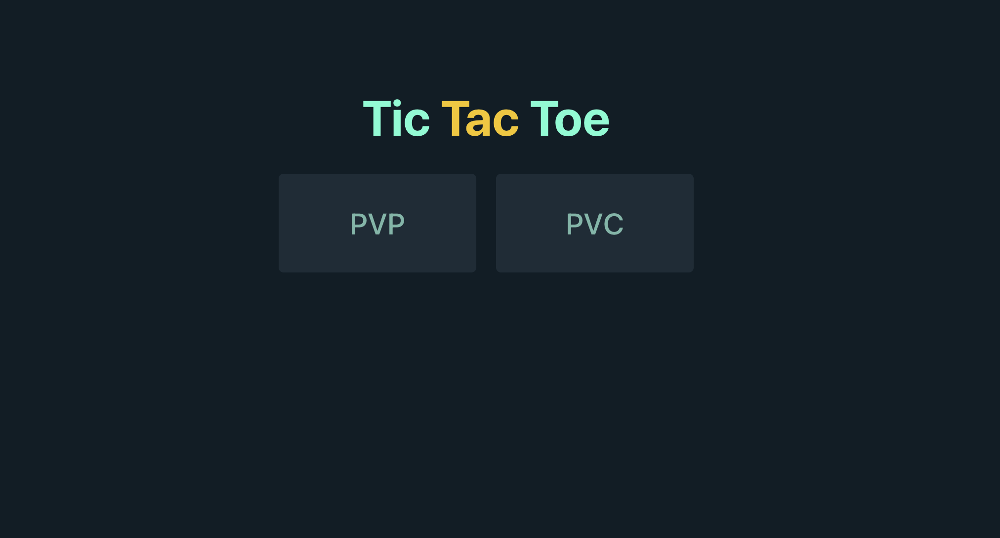
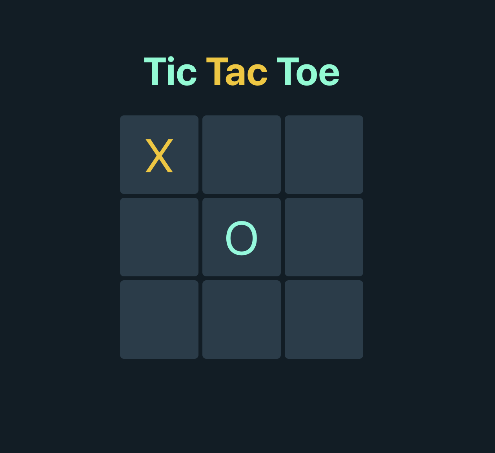
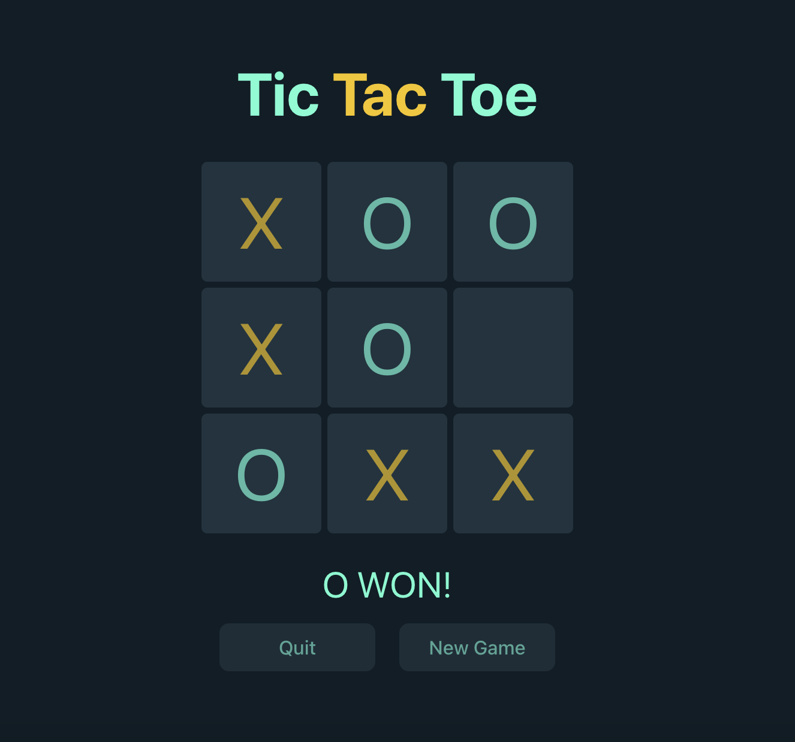

# Tic-Tac-Toe (PVP and PVC)

This is a tic-tac-toe game that allows players to play with another player or play with the computer

### 🚀 [Launch Live Game](https://tic-tac-toe-pvc.netlify.app/)

## Table of Contents

- [Snippets](#snippets)
- [Tech Stack](#tech-stack)
- [Requirements](#requirements)
    - [MVP](#mvp)
    - [Bonus](#bonus)
- [Features](#features)
- [Future Goals](#future-goals)

## Snippets
 

## Tech Stack

- React
- Typescript
- SCSS

## Requirements
### MVP
-   Have two play mode-pvp and pvc
-   It allows two players take turns to play under pvp mode, the one who first makes a line wins
-   Under pvc mode, the computer must make a move automatically after the player makes a move

## Features

- This tic-tac-toe game application has two options: PVP (player versus player) and PVC (player versus computer), the player can choose one option from the home page

- If the player choose the PVC mode, he will be playing with the computer. The player will make move first, and the computer will make a optimised move automatically after the player's move. The one who is the first to get 3 of the marks in a row (up, down, across, or diagonally) is the winner. When all 9 squares are full, the game is over. When the game ends, there will be a message showing which side has won, or if the game is in a tie, with two options of quit the game or play a new game.   

- If the player choose the PVP mode, two players take turns putting their marks in empty squares. The rest of the rules are the same.

## Future Goals
- Use better algorithms (miniMax algorithm) to re-write the logic for the computer

